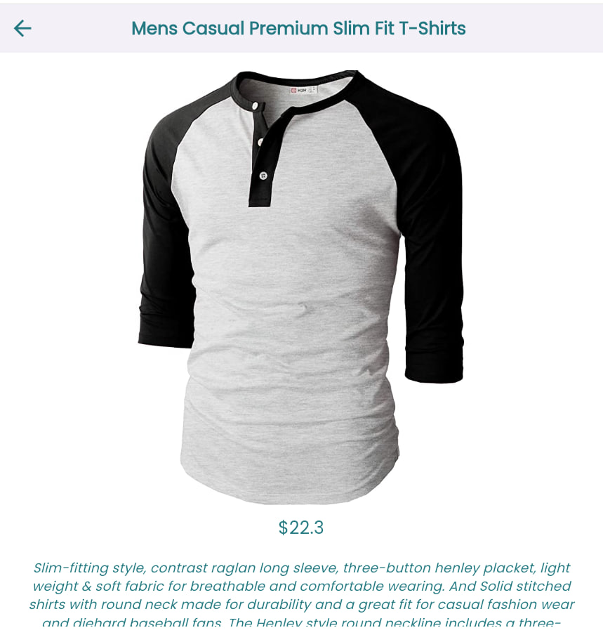
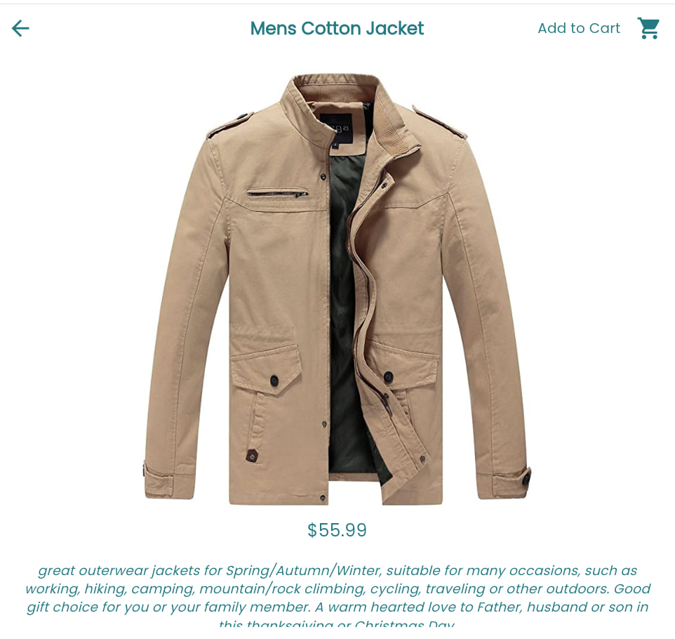

# Mobile-assessment-June-2024

## Objective
Enhance the given Flutter application by adding new features, improving the UI, and fixing bugs. 
*You will have 1 hour and 30 minutes to complete the tasks.*

## Tasks
1. Clone this repository.
2. Complete the following tasks:

### UI Improvements:
   - Modify product cards to be more user-friendly.
   - Modify the product detail page to be more user-friendly.
   - Utilize additional fields in the models to provide more information on the items.
   - Modify the item detail page to improve user-friendliness.
   - You can reference designs from the web for this purpose.
   - You are free to change any widget already used.

### Features:
1. **Item Detail Page:**
   - Add "Add to Cart" functionality:
     - This action should add the items into the "items" list, which will be used to display items in the cart screen.
   - Show the quantity of items added to the cart.

2. **Home Page:**
   - Create a widget that allows users to navigate to the cart screen.

3. **Cart Page:**
   - Add images to the items in the cart screen.
   - Implement the dismiss-to-remove item functionality.

### Bug Fixes:
   - Identify and fix any bugs (if there are any).

### Optional:
   - Write unit tests for the new features.

## Submission
1. Create a new branch with your name.
2. Commit your changes to the new branch.
3. Open a Pull Request to the main branch.
4. Include screenshots of the following pages in your README file:
   - Home/Products screen.
   - Item detail screen before and after adding an item to the cart.
   - Cart screen.

## Evaluation Criteria
- Code Quality
- Functionality
- UI/UX
- Problem-Solving
- Testing (Plus)

## Resources
- [Flutter Documentation](https://flutter.dev/docs)
- [Items API Response](https://fakestoreapi.com/products)
- [State Management Tool Used](https://pub.dev/packages/provider)
- Feel free to use any package of your choice for any purpose.

